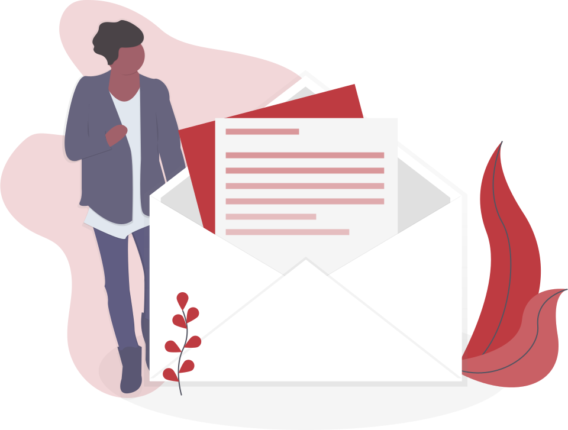

### Introdução
Sabemos que e muito importante ter nosso leitor sempre conosco, compartilhando informações, recebendo feedback e recebendo tudo o que há de mais atual em relação ao conteudo, seja site, blog e apps. Pensando nesse cenario, criaremos hoje um sistema de Newsletter com envio de emails direto para o usuario.

Requisitos do sistema:
1. Criar um base de dados para armazenar as informações do usuario.
2. Criar uma api que receber o email do usuario e envie a mensagem de confirmação da escrição.
3. Criar um front-end ultilizado bootstrap e consumir essa API.

### 1 - Iniciar um projeto com NodeJS
$ npm init -y

### 2 - Criando a base de dados
1 - No terminal digite o seguinte comando 
$ sudo -i -u postgres

2 - No terminal já conectado com o postgres digite 
$ psql(e como se fosse uma interface direta do terminal com a database)

3 - Criaremos um novo "Database" que se chamará "emails", execute o seguinte comando 
$ CREATE DATABASE emails; 
não esqueça do ponto e virgula no final, pois ele e muito importante para dizer ao database que chegamos ao fim do comando.

\c emails

4 - Logo em seguida usaremos o comando 
$ CREATE TABLE emails(
     id SERIAL PRIMARY KEY,
     email TEXT
);

Para criarmos a tabela chamada "emails" para receber os emails que os usuarios irão cadastrar, "ID" será do tipo SERIAL PRIMARY KEY, que signfica que será gerado um numero diferente toda vez que os usuarios cadastrarem um email novo, o campo email será do tipo TEXT.
Com a base de dados pronta seguiremos para os proximos passos.

### 3 - Construindo a estrutura das pastas
Iremos criar uma pasta chamada "api", dentro dessa pasta criaremos outra pasta chamada controller(que e responsavel pelo controle da aplicação como regras de negocios). Criaremos tambem uma pasta com o nome de routes(responsavel por gerenciar as rotas da nossa aplicação).

### 4 - Arquivo server.js
Antes de iniciarmos a nossa aplicação vamos instalar o Express(Que é um framework para criação de servidores web) e o CORS(Que é uma dependencia para permitir que a URL tenha permissão de acesso a API)
Instalação do Express($ npm install express)
Instalação do CORS($ npm install cors)

1 - Crie na raiz do projeto um arquivo chamado server.js e coloque nele o seguinte codigo:
    
    const express = require('express');
    const cors = require('cors');
    const app = express();
    const rotas = require('./routes/index')

    app.use(cors());

    app.use(express.json());

    app.use(rotas);

    app.listen(3000, () => {
        console.log('Servidor rodando...');
    });

### 5 - Arquivo controller/nodemailer.js
Dentro da pasta controller criaremos um arquivo chamado nodemailer.js para colocarmos as configurações do nodemailer:

module.exports = {
    host: "smtp.gmail.com",
    port: 587,
    user: "email_da_empresa",
    pass: "senha_email"
};

### 6 - Arquivo constroller/index.controller.js
Antes de seguirmos, instalaremos a Lib PG(Que e um drive de conexão com o Postgres)
    $ npm install pg
Em seguinda Instalaremos o Lib Nodemailer(Que serve para o envio de emails usando o NodeJS)

Dentro da pasta "controller" criaremos um arquivo chamado index.controller.js, dentro desse arquivo coloque:

    const { Pool } = require('pg')
    const nodemailer = require('nodemailer')
    const SMTP_CONFIG = require('./nodemailer');

    const pool = new Pool({
        host: 'localhost',
        user: 'usuario_banco',
        password: 'senha_do_banco',
        database: 'emails',
        port: '5432'
    });

    const trasporter = nodemailer.createTransport({
        host: SMTP_CONFIG.host,
        port: SMTP_CONFIG.port,
        secure: false,
        auth: {
            user: SMTP_CONFIG.user,
            pass: SMTP_CONFIG.pass
        },
        tls: {
            rejectUnauthorized: false,
        }
    })

    const createEmail = async (request, response) => {
        const { email } = request.body;
        const resp = await pool.query('INSERT INTO  emails (email) VALUES ($1)', [email]);
        sendEmail(email) // depois
        response.json({ message: 'Cadastrado com sucesso! ' });
    }

    async function sendEmail(email) {
        const mailSend = await trasporter.sendMail({
            subject: 'Parabéns!!!',
            text: 'Parabéns, Agora você e assinante da nossa Newslette, prepare-se para Notícias semanas de muito conhecimento.',
            from: 'Leandro Dantas <leandrosuy@gmail.com',
            to: [`${email}`]
        })
    }

    module.exports = {
        createEmail,
        sendEmail
    }

### 7 - Arquivo routes/index.js
Dentro da pasta "routes" criaremos um arquivo chamado index.js, dentro do arquivo coloque:

const { Router } = require('express');
const router = Router();
const { getEmails, createEmail, sendEmail } = require('../controller/index.controller')

router.get('/emails', getEmails)
router.post('/emails', createEmail)
router.post('/sendEmail', sendEmail)

module.exports = router;

### ==================== Partiu criar o front ? ====================================
1 - Construindo a estrutura das pastas
Assim como fizemos na primeira parte, criaremos uma estrutura de pastas para organizar melhor nosso projeto:
Iremos criar uma pasta chamada "css", dentro dessa pasta criaremos arquivo chamado style.css(Ele e responsavel pelo pelos os estilos da nossa aplicação). Criaremos tambem uma pasta com o nome de img(responsavel por armazenar todas as imagens que ultilizaremos em nossa aplicação).
Na pasta raiz criaremos 3 arquivos, "index.html"(que ficara responsavel pela nossa pagina inicial), "agradecimentos.html"(Quando ocorrer tudo certo, o usuario será direcionado para está pagina) e por fim a pagina de "erro.html"(Que caso de erro em nossa aplicação, será direcionada para ela).

### 1 - Página index.html
Dentro da pagina index.html coloque: 
<!DOCTYPE html>
<html lang="pt-br">
    <head>
        <meta charset="UTF-8">
        <meta http-equiv="X-UA-Compatible" content="IE=edge">
        <link rel="preconnect" href="https://fonts.googleapis.com">
        <link rel="preconnect" href="https://fonts.gstatic.com" crossorigin>
        <link href="https://fonts.googleapis.com/css2?family=Poppins:wght@300;400;500;600;700;800;900&display=swap" rel="stylesheet">
        <meta name="viewport" content="width=device-width, initial-scale=1.0">
        <link rel="stylesheet" href="https://stackpath.bootstrapcdn.com/bootstrap/4.1.3/css/bootstrap.min.css" integrity="sha384-MCw98/SFnGE8fJT3GXwEOngsV7Zt27NXFoaoApmYm81iuXoPkFOJwJ8ERdknLPMO" crossorigin="anonymous">
        <link rel="stylesheet" href="css/style.css">
        <title>Newsletter</title>
    </head>
    <body>
        

            

                <section class="col-sm-8 offset-sm-2 col-lg-6 offset-sm-3 my-2">
                    

                        
                        <h3 class="mb-3">Inscreva-se para receber as novidades</h3>
                        
 Uma newsletter de curadoria de conteúdo é aquela que entrega no email dos assinantes um compilado de artigos ou vídeos postados recentemente ou que foram escolhidos como os melhores da semana.

                        <form id='form'>
                            <input type="text" class="form-control input-bg" placeholder="Digite seu email" id="input_email" name="input_email">
                            <input type="submit" class="btn btn-bg btn-block mt-3 rounded-pill" value="Enviar"/>
                        </form>
                    

                </section>
            

        

        
        
    </body>
</html>

### 2 - No arquivo style.css
Dentro do arquivo style.css coloque:
* {
    margin: 0;
    padding: 0;
    box-sizing:  border-box;
}
body {
    min-height: 100vh;
    display: flex;
    align-items: center;
    justify-content: center;
    font-family: 'Poppins', sans-serif;
}

.logo-img{
    margin: 0 auto;
}

.form-control:focus {
    border-color: #ddd;
    box-shadow: none;
}

.btn-bg {
    background-color: #fc4e51;
    color: #fff;
    padding: 12px;
}

.input-bg {
    height: 45px;
}

### 2 - Página agradecimentos.html
Dentro da pagina agradecimentos.html coloque: 
<!DOCTYPE html>
<html lang="pt-br">
    <head>
        <meta charset="UTF-8">
        <meta http-equiv="X-UA-Compatible" content="IE=edge">
        <link rel="preconnect" href="https://fonts.googleapis.com">
        <link rel="preconnect" href="https://fonts.gstatic.com" crossorigin>
        <link href="https://fonts.googleapis.com/css2?family=Poppins:wght@300;400;500;600;700;800;900&display=swap" rel="stylesheet">
        <meta name="viewport" content="width=device-width, initial-scale=1.0">
        <link rel="stylesheet" href="https://stackpath.bootstrapcdn.com/bootstrap/4.1.3/css/bootstrap.min.css" integrity="sha384-MCw98/SFnGE8fJT3GXwEOngsV7Zt27NXFoaoApmYm81iuXoPkFOJwJ8ERdknLPMO" crossorigin="anonymous">
        <link rel="stylesheet" href="css/style.css">
        <title>Obrigado!</title>
    </head>
    <body>
        

            

                <section class="col-sm-8 offset-sm-2 col-lg-6 offset-sm-3 my-2">
                    

                        
                        <h3 class="mb-3 text-center">Obrigado pela inscrição</h3>
                        
 Acompanhe seu sua caixa de e-mail para mais detalhes.

                        <input type="submit" class="btn btn-bg btn-block mt-3 rounded-pill" value="Voltar" onclick="goBack()"/>
                    

                </section>
            

        

        
        
    </body>
</html>

### 3 - Página agradecimentos.html
Dentro da pagina error.html coloque:
<!DOCTYPE html>
<html lang="pt-br">
    <head>
        <meta charset="UTF-8">
        <meta http-equiv="X-UA-Compatible" content="IE=edge">
        <link rel="preconnect" href="https://fonts.googleapis.com">
        <link rel="preconnect" href="https://fonts.gstatic.com" crossorigin>
        <link href="https://fonts.googleapis.com/css2?family=Poppins:wght@300;400;500;600;700;800;900&display=swap" rel="stylesheet">
        <meta name="viewport" content="width=device-width, initial-scale=1.0">
        <link rel="stylesheet" href="https://stackpath.bootstrapcdn.com/bootstrap/4.1.3/css/bootstrap.min.css" integrity="sha384-MCw98/SFnGE8fJT3GXwEOngsV7Zt27NXFoaoApmYm81iuXoPkFOJwJ8ERdknLPMO" crossorigin="anonymous">
        <link rel="stylesheet" href="css/style.css">
        <title>Error!</title>
    </head>
    <body>
        

            

                <section class="col-sm-8 offset-sm-2 col-lg-6 offset-sm-3 my-2">
                    

                        
                        <h3 class="mb-3 text-center">Error interno</h3>
                        
 Alguma coisa aconteceu com nossos serviços, tente novamente!

                        <input type="submit" class="btn btn-bg btn-block mt-3 rounded-pill" value="Voltar" onclick="goBack()"/>
                    

                </section>
            

        

        
        
    </body>
</html>

### ==================== Hora de conectar tudo!!! \o/ ====================================
### 1 - Arquivo api/app.js
Dentro do arquivo app.js:
var form = document.getElementById('form');
var input = document.getElementById('input_email');

form.addEventListener('submit', (e)=>{
    if(input.value === ""){
        alert('O campo e-mail não pode ficar em branco!')
    } else {
        var inputValor = input.value;
        enviarEmail(inputValor)
    }
    e.preventDefault();
});

async function goBack(){
    window.location.href = 'index.html'
}

async function enviarEmail(valor){
    const email = valor;
    axios.post('http://localhost:3000/emails', {email})
    .then((response) => {
        window.location.href = 'agradecimentos.html'
    })
    .catch((error) => {
        window.location.href = 'error.html'
    })
}

### ==================== Vamos aos testes \o/ ====================================
Deu tudo certoooooo !
Até a proximaaaaaaa.....